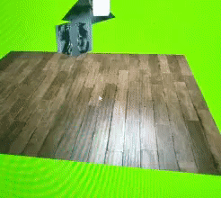

# OpenGL
#In progress

Previews (wait for gifs to load):

Blinn-Phong light model (OpenGL 4.6, GLSL) (GIF)

Model Importer (glTF2) (OpenGL 4.6, GLSL) (GIF)

Skybox (DirectX11, HLSL) (GIF)

PostProcessing (DirectX11, HLSL) (GIF)

ShadowMapping (DirectX11, HLSL) (GIF)

Animation (DirectX11, HLSL) (GIF)

Tessellation (DirectX11, HLSL) (GIF)

